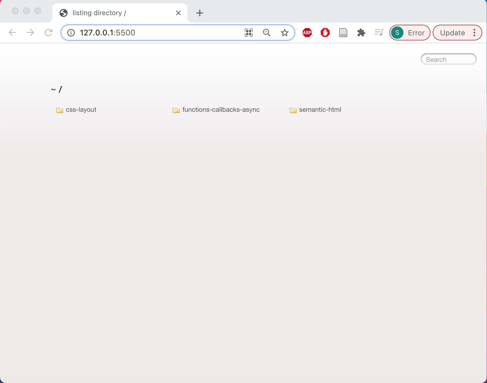

# Safia-timer

## FAC21 Pre-course - Week 4 - Mini Project : Pomodoro Timer
---
## Objective

Build a “[Pomodoro](https://en.wikipedia.org/wiki/Pomodoro_Technique) timer”.

### *Features*
- [ ] A “work” timer that counts down to zero (usually 25 minutes)
- [ ] A second “break” timer that counts down to zero (usually 5 minutes)
- [ ] Buttons to start a session, pause the timer, or cancel the session and restart

### *Stretch goals*
- [ ] Customisable lengths of time for work/break
- [ ] Play an alarm sound to make it obvious the time is up

---

## Process
- I was aware of what a pomodoro timer was, but i did further research on the subject and got inspiration on my timers functionality from the [Apple Apps store](https://apps.apple.com/gb/app/be-focused-focus-timer/id973130201) 

- I decided on the what features I wanted my timer to have
  - [ ] Set pomodoro interval (0-60minutes)- default set to 25minutes.
  - [ ] Set short break (0-60minutes)- default set to 5 minutes.
  - [ ] Set long break (0-60minutes)- default set to 30 minutes.
  - [ ] A START button, which when pressed changes to STOP.
  - [ ] A INTERVAL box which shows 0/4 at  the start and increases with each interval. At 4/4 , long break is activated after which the interval re-sets to 0/4.
  - [ ] Sounds 
    - [ ] ticking sound for pomodoro interval
    - [ ] ringing bell sound when break starts
    - [ ] ticking sound for short break
    - [ ] ringing bell sound when short break over
    - [ ] ticking sound for long break starts
    - [ ] ringing bell sound when long break over
  - [ ] Vibrations when end of interval/break, along with ringing sound.
  - [ ] Background color changes with pomodoro interval/break
  
-  I created a new repo in github, with a README.md file. I used SSH to git clone the repo in my local terminal
-  I created a index.html and decided to add `style` and `script` tags instead of creating separate files. If the script code gets tolong I may create a separate `script.js` file.
  
  
---

## Things I Learnt

***Issue 1 -***
When i was cloning my github repo to my local terminal, i ran the SSH link but kept getting this error.

```zsh
zsh: no such file or directory: https://github.com/fac21/safia-timer.git
```

***Solution 1 -***
I forgot to add `git clone` before adding the SSH link. :see_no_evil: :joy:

---

***Issue 2 -*** I wanted to add a boiler HTML template using the Emmet abbreviation `!`. It wouldn't work. 

***Solution 2 -*** I was adding `!` to an untitled file so i was unable to access the boilerplate. Once is saved the file with html extension `index.html` it worked.:exclamation: 

---
***Issue 3 -*** VS code live server was opening a listing directory instead of running the code in the browser. 
(To take a screen shot on a *mac* press **Shift+Command+3** )

***Solution 3-*** The folder where i saved my project files (hml, css, js) did not have a workspace assigned to it. So my files were pointing to the wrong path. I created a new folder "pomodoro-timer" in my fac21 folder on my desktop and opened VS code and opened new folder ("pomodoro-timer). I then opened the index.html file and the live sever worked!!! :smile: :sparkles:

I was able to solve this issue using this [Stack Overflow](https://stackoverflow.com/questions/55073031/why-is-vs-code-live-server-opening-a-directory-instead-of-running-the-code-in-th) article and this [YouTube](https://www.youtube.com/watch?v=fpyzIDuK0wU) video. This YouTube video helped me learn more about [workspace](https://www.youtube.com/watch?v=W4xLtxLSm-o&t=26s).

---
***Issue 4 -***

***Solution 4-***


---

## Resources 

- [YouTube](https://www.youtube.com/watch?v=afFb_DcBBdA) - ***Markdown Inserting Images*** by Thomas Bradley
- [Medium](https://medium.com/markdown-monster-blog/getting-images-into-markdown-documents-and-weblog-posts-with-markdown-monster-9ec6f353d8ec)- ***Getting Images into Markdown Documents and Weblog Posts with Markdown Monster*** by Rick Strahi
- [codebase]() - ***Syntax highlighting in markdown*** by Dan Quinney
- [icons8](https://icons8.com/) - *Icons, illustrations, photos, music, and design tools*